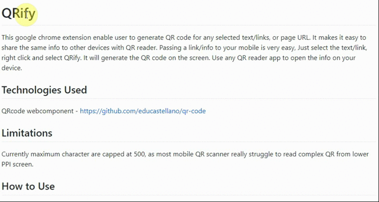

#  QRify
This google chrome extension enable user to generate QR code for any selected text/links, or page URL. It makes it easy to share the same info to other devices with QR reader. Passing a link/info to your mobile is very easy, Just select the text/link, right click and select QRify. It will generate the QR code on the screen. Use any QR reader app to open the info on your device.

## Technologies Used
QRcode webcomponent - [https://github.com/educastellano/qr-code](https://github.com/educastellano/qr-code)

## Limitations
Currently maximum characters for Text Selection are capped at 500 and for links that limit is 600, as most mobile QR scanner really struggle to read complex QR from lower PPI screen.

## How to Use
### This extension is now published to Chrome Webstore - [link](https://chrome.google.com/webstore/detail/qrify/nnokneneaanlmkpcibflacfhhneijagl).

#### Alternatively you can add it via **Developer Mode**:
   - Download and extract the [release zip](https://github.com/DamandeepS/QRify/archive/v0.1.7.zip).
   - Go to Chrome Extensions Page.
   - Enable Developer mode.
   - Select Load Unpacked --> Select the directory where you extracted the zip.
   - Enable the Extension if not enabled by default.
    
    
   
### Note
Chrome might ask you to disable the Extension on next session as this is using **Developer Mode**.

### Demo

